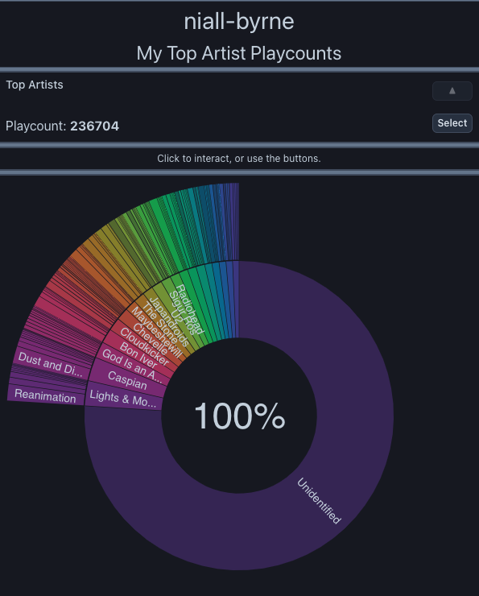

October, 2023.

# Refactor

Since the original implementation of this project the structure of the code base has changed substantially. After reading [Clean Architecture](https://blog.cleancoder.com/uncle-bob/2012/08/13/the-clean-architecture.html), I was encouraged to try and refactor this project away from the typical 'react-project' layout.

I would describe this as very much a work in progress and feel there is much more restructuring to be done. However, at the same time I recognize that the "architectural intent" of the project is much now more apparent, so progress has definitely been made!

## Components

I began first by attempting to extract components from the code base. Naturally this lent itself towards the backend api and frontend client, but there were quite a few others that emerged naturally during this process. (It's worth clarifying that these are architectural components, and are very distinct from React components.)

Refactoring was greatly helped by a simple [architecture enforcement script](../.github/scripts/architecture.sh) I wrote to enforce boundaries between the components. It may make sense to eventually put these components in different code bases, but there is over-head associated with this, and it wasn't immediately feasible during refactoring. For now I'm happy with the mono-codebase structure.

The components are found in the top level [src](../src) folder:

| Level | Component Name | Function                                                                                                                                                                                                                                      |
| ----- | -------------- | --------------------------------------------------------------------------------------------------------------------------------------------------------------------------------------------------------------------------------------------- |
| 1     | config         | Provides simple JS objects defining configurable behaviour.                                                                                                                                                                                   |
| 2     | utilities      | Provides simple Vanilla JS utilities.                                                                                                                                                                                                         |
| 3     | fixtures       | Provides a set of classes and functions to simplify testing.                                                                                                                                                                                  |
| 4     | contracts      | Provides types, schemas and concrete data fixtures to define the interactions between components.                                                                                                                                             |
| 5     | vendors        | 3rd party libraries and types are encapsulated here to contain them within the code base. Provides a series of "vendor objects" that are consumed by the higher components components.                                                        |
| 6     | api            | Provides services that are consumed by the 'web' component.                                                                                                                                                                                   |
| 7     | web            | Provides the UI and consumes the 'api' component as a service.                                                                                                                                                                                |
| 8     | pages          | This component exposes the 'api' and 'web' components to each other. Although a convention of the [next.js](https://nextjs.org/) framework, it serves an architectural function in controlling the borders of the 'api' and 'web' components. |
| 9     | tests          | This unfortunately is not a true component, but rather the most logical place I could find to put tests for the pages component.                                                                                                              |

### Entities

Insides each Component folder, you'll find sub-folders for each of it's business entities.

These entities represent the primary "business" concerns of each component.

#### Use Cases

Finally, underneath the entities are the various use cases of each entity. These loosely correspond to shipped features of the application.

# Features

The primary feature shipped during the last iteration was the 'Count by Artist' report for last.fm.

This report aggregates together hundreds of API requests of a given user's Artist and Album listening habits to create an interactive chart.

This chart is built by showing the proportion of all listens belonging to the user's Top 20 most listened to artists. Each of these Top 20 Artists then has their listens sorted into their 20 most popular albums (popularity here is defined by the last.fm API). The remaining listens outside of these constraints are classified as "unidentified".

The result is a pretty fun tool to explore your listening habits with respect to your favourite Artists:
 

# Technologies Used

Due to the nature of the report aggregating together so many API calls, caching was a primary concern before releasing the feature:

- Each individual API response is cached by the browser for 24 hours to ease the load on the last.fm API
- Completed reports are then sent to S3, where they are cached by CloudFront for 24 hours to provide fast retrieval
- Completed reports are also cached by the browser when retrieved to ease the load of CloudFront

Validation of reports sent to the caching service is handled by [ajv](https://ajv.js.org/), in the form of a JSON schema definition.

On the Frontend the [d3](https://d3js.org/) library's [Sunburst](https://observablehq.com/@kerryrodden/sequences-sunburst) chart provided the backbone of the UI data presentation, and was typed (TypeScript) incredibly well.

One of the secondary goals for this feature, was to implement it behind a Feature Flag, allowing code to be merged into mainline without exposing it prematurely. My refactors to encapsulate 3rd party vendors made me confident enough to try [Flagsmith](https://www.flagsmith.com) as a solution, knowing that I could swap it out later if I overran the free tier. The service has been very good to work with in general.

## Hurdles

This was a very difficult feature to put together, and there were many obstacles along the way.
Some of the biggest challenges I faced are listed below.

### Caching

Determining the correct approach for caching was very troublesome to iron out effectively.
I was very concerned about last.fm's API being subject to undue amounts of traffic. But where should requests and reports be cached, and by what method?

It was very tempting at multiple points to build something myself, but in the end judicious use of 'Cache-Control' headers provided the best mechanism to cache individual API results.

In terms of caching completed reports, I was looking into ways to cache these locally until it dawned on me that I could reuse the existing S3/CloudFront infrastructure as a solution. This is when I started work on what I'm calling the "Caching Service".

Completed reports are sent to the Caching Service, and can be retrieved later without having to recalculate the report from aggregate api requests. I believe this makes for a better user experience, and also saves the last.fm API from being subject to undue amounts of traffic.

I was very worried about possible abuses of the Caching Service itself. Particularly two ways:

1. malicious users might store arbitrary data in the Caching Service
2. malicious users might poison the cached results of other users with contrived results

Strict validation of uploaded report results via [ajv](https://ajv.js.org/) and a well written JSON schema makes it impractical as a place to store arbitrary data. I believe this solved problem number 1.

In terms of cache poisoning, I decided to have the API restrict generated caches based on the authenticated user so that users may only cache results for themselves. Although this prevents the sharing of cached data between users, it makes cache poisoning a futile exercise.

In the future I'd like to be able to create a separate set of "report snapshots" that provide a way to share what your chart looked like on a particular date. The mechanism for generating the ObjectID would have to be different for this use case to avoid another vector for cache poisoning.

### Aggregation

The challenge of aggregating together so many API requests into a coherent React State object was particularly interesting.

One of the constant struggles was ensuring I was making things "generic" enough so that other types of reports could be created, and that data sources other than last.fm could eventually be used.

In practice this meant using interfaces and abstract classes rather than creating one-off concrete implementations immediately.

## Future Plans

- I've noticed quite a few places where the structure of the code could be further improved, to make the architecture "cleaner". However, at this point it's mostly about folder naming as opposed to the massive refactors that were undertaken previously.
- I'd like to test the "generic-ness" of my solution by providing other aggregate type reports for users to check out.
- I'm still interested in connecting other data sources such as [Spotify](https://www.spotify.com/).
